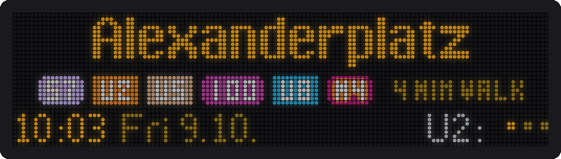
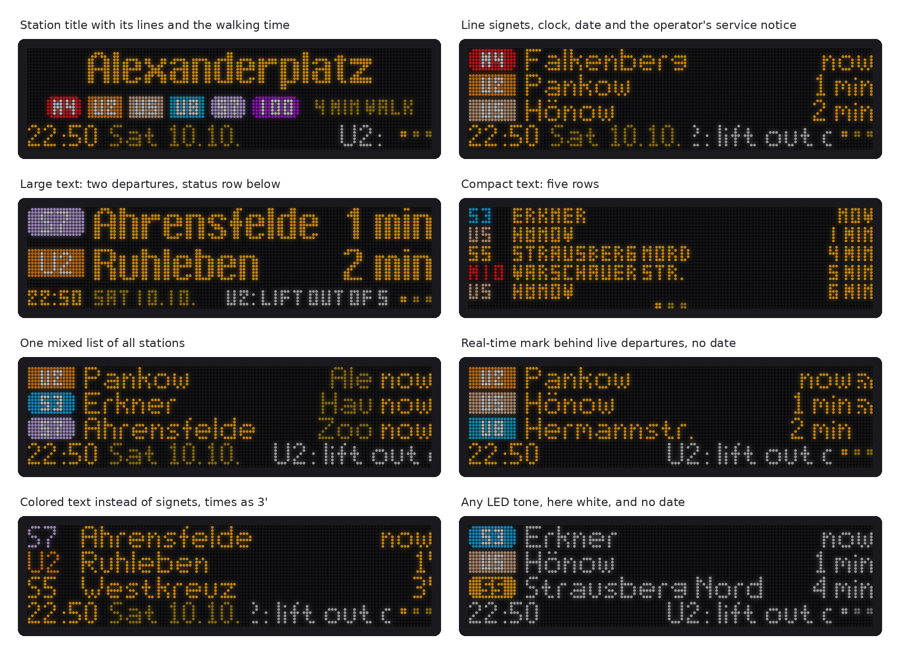
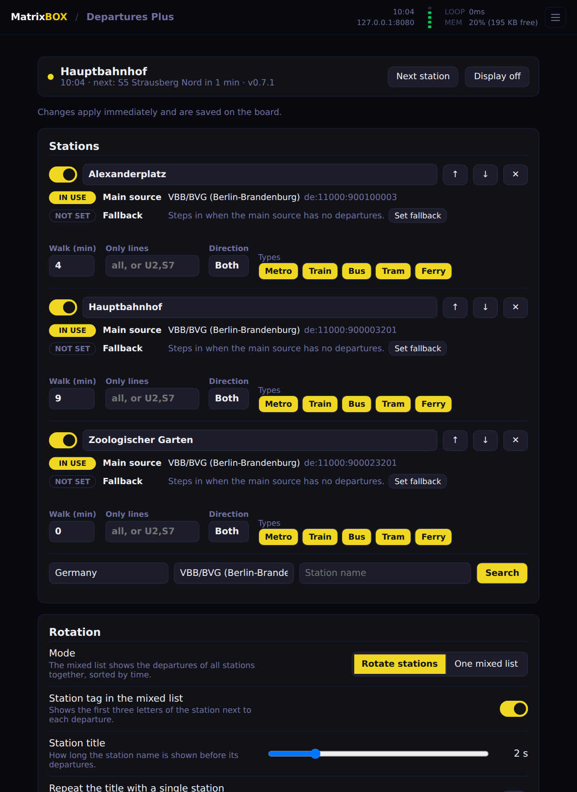

# Departures Plus for MatrixBOX

<p align="center">
  
</p>

A departure board app for [MatrixBOX](https://github.com/MatrixBOX-dev/matrixbox), the open firmware of the T-Skylt LED boards. It is a rebuild of the stock *Departures* app with a different focus: several stations in rotation at full text size, line signets in the operator's colors, and a status row with clock and ticker that Home Assistant can write to.

This is a community project and not affiliated with T-Skylt Sweden AB. It gets its departures from the same data server as the stock app.

## What it does

* **Station rotation.** Any number of stations, each with a title showing its lines and your walking time. Or one mixed list of all stations.
* **Line colors.** Filled signets, colored text or plain. Berlin (VBB/BVG) and Stockholm (SL) colors are built in.
* **Status row.** Clock, date and a ticker for your own text, messages from Home Assistant and the operator's service notices.
* **Real-time mark.** Tells live departures from timetable ones, where the operator's data says so.
* **Per station:** walking time, a filter by line, direction and vehicle type, and a fallback data source that steps in when the main one has no departures.
* **Display:** three text sizes, ten LED tones or your own, brightness, margins, 180° rotation, a schedule per weekday, sleep while nothing departs.
* **Home Assistant:** power, brightness, shown station, next departures and ticker messages through the [T-Skylt integration](https://github.com/jnbp/t-skylt). A ticker message can light up just the ticker while the display is off.



## Install

You need a board running MatrixBOX and about 100 KB of free storage. The board must not be connected to a computer by USB while you install, because its storage is read-only to its own code then.

**Windows:** download `departuresplus-install.bat` from the [latest release](https://github.com/jnbp/matrixbox-departures-plus/releases/latest), double-click it and enter the board's IP address.

**macOS and Linux:** download the zip from the latest release, unpack it and run

```sh
python3 install.py 192.168.1.50
```

Both copy the app over Wi-Fi into `/departuresplus` on the board and start it. Updating works the same way: the installer removes the previous version first and keeps your stations and settings.

**By hand:** copy the folder `departuresplus` to the root of the board with the board's own file manager and start the app from the home screen.

## Settings

Open `http://<board ip>/` while the app is running. Changes apply immediately and are saved on the board.

<p align="center">
  
</p>

## Home Assistant

Install the [T-Skylt integration](https://github.com/jnbp/t-skylt) (0.3.1 or newer) and add the board while Departures Plus is running. Sending a ticker message is then a standard notify action:

```yaml
action: notify.send_message
target:
  entity_id: notify.t_skylt_ticker
data:
  message: "Door opened"
```

Anything else can use the app's API directly:

| Call | Effect |
| :--- | :--- |
| `GET /api/state` | Current station, next departures per station, temperature, uptime |
| `GET /api/set?power=0` | Display off (`1` = on) |
| `GET /api/set?next=1` | Next station |
| `GET /api/set?pin=1` | Hold station 1 (`-1` = rotate again) |
| `GET /api/set?brightness=3` | Change any setting. Add `&save=1` to keep it after a restart. |
| `GET /api/message?text=Door%20opened&ttl=60&id=door` | Ticker message for 60 seconds. `ttl=0` keeps it until cleared, `wake=1` shows it even while the display is off. |
| `GET /api/message?clear=1` | Clear the ticker messages (`&id=door` clears one) |
| `GET /api/config`, `POST /api/config` | Read, or write and save, all settings as JSON |
| `GET /api/debug` | Last request to the data server, memory, errors |

## Good to know

* **Data.** Departures come from T-Skylt's data server, like in the stock app. Which operators exist and how good their data is depends on that server.
* **Delays.** Most operators, Berlin included, deliver times that already contain the delay. The `+3` style only shows something where an operator sends the delay separately.
* **Real-time mark.** Not every operator marks timetable-only departures. Berlin's *VBB/BVG* source does, *Berlin (Unofficial API)* does not.
* **Tested on** a T-Skylt X (128×32) with MatrixBOX v0.97. The other sizes (XS, XL, 2X) and newer firmware are tested in the simulator only.

## Try it without a board

```sh
git clone https://github.com/MatrixBOX-dev/matrixbox
git clone https://github.com/jnbp/matrixbox-departures-plus
pip install git+https://github.com/MatrixBOX-dev/simulator
cp -r matrixbox-departures-plus/departuresplus matrixbox/apps/
python3 matrixbox-departures-plus/tools/demo_server.py &          # made-up departures for three Berlin stations
matrixbox app matrixbox/apps/departuresplus --size X              # terminal 1
matrixbox simulator                                               # terminal 2
```

The settings page is then at `http://127.0.0.1:8080/`. To use the demo data, open *Advanced* there and set the data server to `127.0.0.1`, port `9090`, then search for "Berlin".

The pictures on this page are rendered from the app by `tools/render_docs.py`, and `tools/build_installers.py` builds the release files.

## License

MIT, like MatrixBOX. See [LICENSE](LICENSE).
